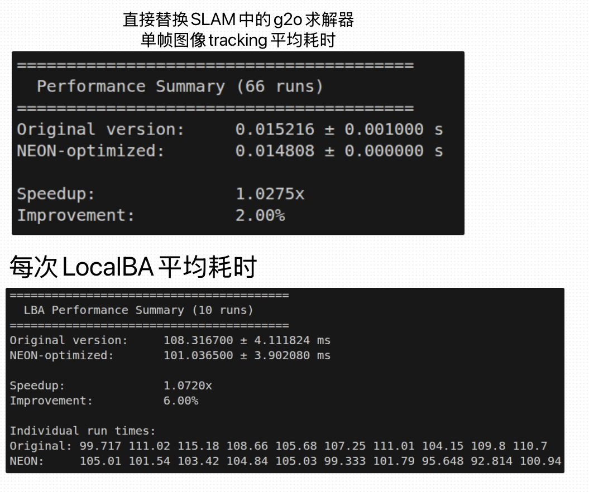

1.
  跑的demo:
    ./Examples/Monocular/mono_tum Vocabulary/ORBvoc.txt Examples/Monocular/TUM1.yaml ./dataset/rgbd_dataset_freiburg1_xyz
    ./Examples/Monocular/mono_tum Vocabulary/ORBvoc.txt /home/lyh/ORB_SLAM3/myvideo/redmi.yaml ./myvideo2 

2. 
  g2o线性求解器替换：
    llt-neon-kernel：    /home/lyh/ORB_SLAM3/lyh-cholesky.h
    仿eigen接口实现：  /home/lyh/ORB_SLAM3/lyh_fake_ldlt.h
    g2o线性求解器新增： /home/lyh/ORB_SLAM3/Thirdparty/g2o/g2o/solvers/linear_solver_dense_neon.h

3.
  性能测试脚本： /home/lyh/ORB_SLAM3/compare_performance.sh
  结果： 

